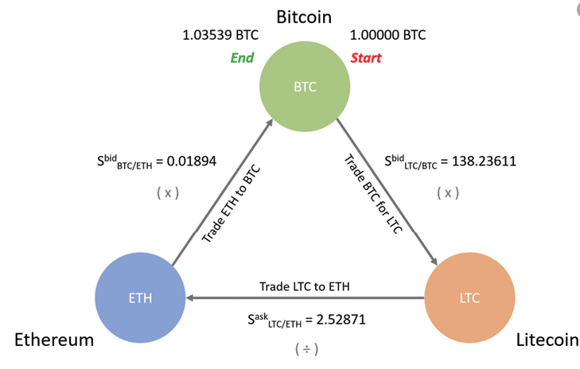
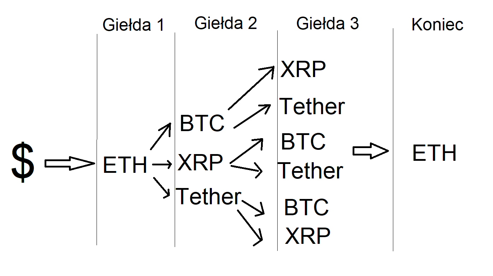

**Kryptonite - algorithm description.**

Our task is to implement triangular arbitrage algorithm.  
Below is picture which shows us example of the problem.  

The phenomenon of arbitrage occurs in most of commercial fields. We want to use the differences on individual exchanges to find a chance for potential profit. What is the difference? The difference is that systems sometimes update data too slowly, so that 
in different forex markets the price when exchanging one cryptocurrency for another may be slightly different. Our goal is to find these discrepancies and predict how they affect our original amount, whether we will make a profit or a loss. It should be noted that such discrepancies are relatively uncommon. This is certainly an interesting phenomenon for both mathematical and economic reasons, but due to the limitation of the speed of data transfer it is not always possible to implement.

Originally, we wanted to implement the entire algorithm based on a graph, in which the vertices are individual cryptocurrencies on individual exchanges, and the path weights are the differences resulting from the fact of changing a given currency for another. Through connections between exchanges look for the best path through which we will earn the most. However, at this point an additional problem would have to be solved, how to create a graph and create a representation for individual vertices.

After reconsideration, we decided that the best way is to create an iterative algorithm that checks all conversion options from each currency to another and creates the cycles that you can see in the graphic above.

First, we should download api from various exchanges. Then convert this api to our representation, which the algorithm will use. Our idea is to represent api through a dictionary. It is a simple way of data representation and has quite a lot of development opportunities.

Each api will be downloaded by the appropriate functions in the classes and saved to them. Then all data will be converted to our proprietary dictionary so that the algorithm can easily search and determine the most positive path for us. At a later stage, commissions will be included.

We want our algorithm to determine the minimum amount that should be invested to use the phenomenon described above - this functionality will be added after commission. Usually, the parties charge a one-time commission of up to% on transactions, thanks to which, with larger amounts, trade and exchange between exchanges will pay off more and more.

In the first phase of algorithm writing, we want it to support 3 exchanges. This will allow us to efficiently implement and observe the initial data. After implementing the initial algorithm, we will check how efficiently it can be done for more exchanges and how to present it in an accessible form.

The problem we have to solve is how to represent (what hierarchy to do in the dictionary) and how to send data so that the algorithm can calculate it efficiently and everything works smoothly on the server. We have 512MB RAM available, which can be quickly filled up with considerable calculations. Therefore, we will have to respond to any problems on a regular basis.

Below is a conceptual sketch of the algorithm. 

