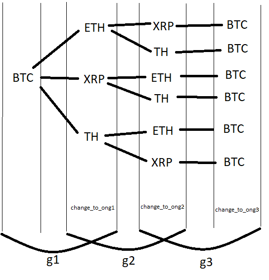

# Triangular arbitration algorithm - Kryptonite project.

First, our application fetches data about cryptocurrencies pairs rates from external APIs of four different crypto-exchanges,
in specified time span.
This data is parsed to json object, which can be easily used in implementation of algorithm.

Using obtained data we are performing triangular arbitrage algorithm.
The algorithm consists in searching the tree, which is represented as json data.
Sample data for one exchange:
```json
{
    "name":"ONE",
    "currencies":["BTC","ETH","LTC"],
    "data":[
        {
            "currency":"BTC",
            "transaction_fee": 0.009,
            "trades":[
                {
                    "change_to":"ETH",
                    "records":[
                        {
                            "date": 1592182800000,
                            "rate": 40.45471095109025

                        },
                        {
                            "date": 1592183100000,
                            "rate": 40.4942159581025

                        }
                    ]
                }
            ]

        },
        {
            "currency":"ETH",
            "trades":[
                {
                    "change_to":"LTC",
                    "records":[
                        {
                            "date": 1592183100000,
                            "rate": 5.315723462

                        },
                        {
                            "date": 1592183100000,
                            "rate": 5.768342467

                        }
                    ]
                }
            ]
        }
    ]
}
```


The data for each exchange will be saved in an array. Thanks to this, you can easily create combinations of triples that we can process.
To generate triples, use the `generate_combination_of_three` method to get the value
of length of the stock array and returns a list containing combinations of three.
Then, going through the returned list, we save the values ​​of individual exchanges into variables.

Below is a graphic showing the currencies. On the left for the given exchange is the currency from which we exchange, and on the right the currency for which we exchange. There are also variables that are in the loops.



Example:
```
BTC  ->  ETH  ->  XRP  ->  BTC   //currencies  
    rate     rate     rate       //collecting values
```  


The next step is to assign specific data to the `currencies_g1` variable
from the "data" table using the `returnspecific_currency_from_data` method, which receives the value of exchange 1 and the value of the start currency.
For the data above - for `start_currency` = "ETH" the return will be as below:
```json
{
    "currency":"ETH",
    "trades":[
        {
            "change_to":"LTC",
            "records":[
                {
                    "date": 1592183100000,
                    "rate": 5.315723462

                },
                {
                    "date": 1592183100000,
                    "rate": 5.768342467

                }
            ]
        }
    ]
}
```


Then enter the first loop in which we iterate over the "trades" array located in the variable `currencies_g1` to read the values. The value read looks like:
```json
{
    "change_to":"LTC",
    "records":[
        {
            "date": 1592183100000,
            "rate": 5.315723462

        },
        {
            "date": 1592183100000,
            "rate": 5.768342467

        }
    ]
}
```


then in the loop we assign the data from the result of the function `specific_currency_from_data` for exchange 2 and the value "change_to" from `currencies_g1` to the `currencies_g2` variable.

In the next loop, we iterate through the array "trades" in the variable `currencies_g2`
at the same time checking that from 2 exchanges do not convert to currency from 1 exchange.

Then we write the values ​​returned by the method `return_specyfic_currencies_in_trades` to the variable `change_to_ong3`, which returns a json having the same structure as the return values ​​from the `specific_currency_from_data method`, but the method is characterized by the fact that it only returns an element that exchanges from some currency for the starting currency.

In the next loop, iterates and checks the specific elements contained in the "records" table, then adds them to the `list_rates` table, which is passed along with the initial quantity
to the `return_end_count` function, which returns the supposed highest value. If `include_fees` flag is set to True, list of transactions fees is also passed to the function and fees are included in calculations. The next line checks if it achieved value is larger than starting value.

Then, if there is a value greater than or equal to the maximum, result dictionary is created, which holds all important data about transactions that could provide profit.

# Summary and Conclusions

 After multiple launches of the algorithm for different time frames we could observe that we can find potential profit
 quite often, even in time span of few hours. However, that profit value is not exactly accurate, because of some
 simplifications we made during our work on this project.
 
 First important thing is skipping in our simulation process of deposit and withdrawal from subsequent exchanges.
 Every such operation takes some time and in most cases generates additional loss from withdrawal fees, which were not
 included in our algorithm. Performing such operations as suggested by results of algorithm is not so profitable and can
 be limited but technical capabilities of exchanges. Because crypto-currencies market is very fluent, 
 opportunities might be loss because of withdrawal and transactions time.
 
 Our other assumption worth mentioning is available amount of given currency. Algorithm calculates profit based on initial
 value and rates of currencies pairs, but it doesn't take into account how much we can buy/sell in this exact moment.
 Therefore, it is not certain that we could operate with whole owned amount as we would like to, which decreases potential
 profit.
 
 Overall, it was an interesting experiment, but solution working in a real environment would have to be more complex,
 as there are a lot of factors that must be included in such a program to find and use an actual opportunity.
